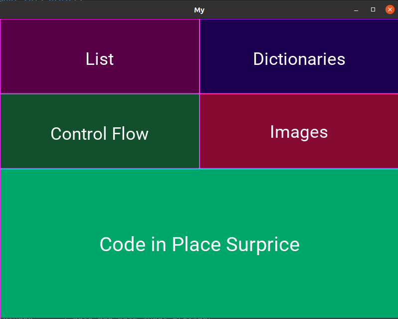
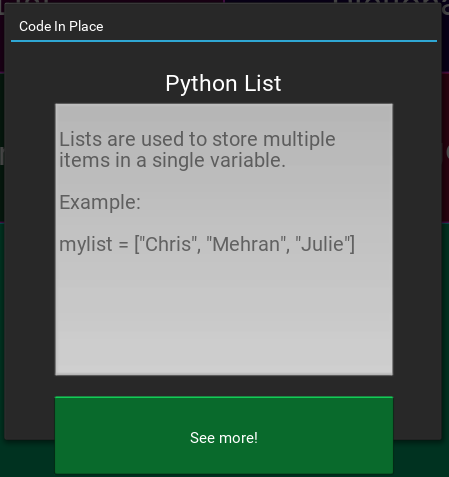
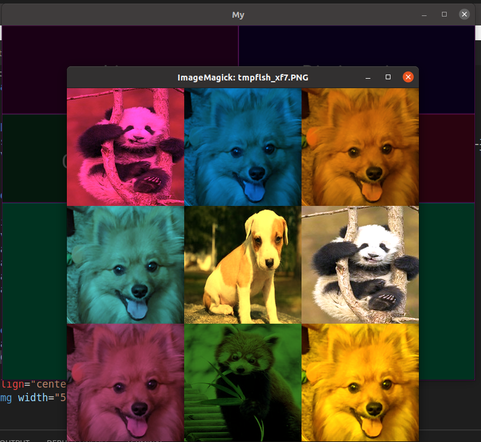

# **Code In Place Final Project**


"Code in Place is a free introductory programming course using the Python language, based on material from the first half of Stanford University's established intro course, CS106A. "

:mega: More info: [here](https://codeinplace.stanford.edu/)

## **About this project**  :paw_prints:
It is a project where I am summarizing everything I have learned in Code In Place: 
  * Lists
  * Dictionaries
  * Images
  * Control Flow.

I have included a new library that I learned to create interfaces with Python, this library is **Kivy** Python.  :blue_car:


## **How to use it:**  :jack_o_lantern:
```bash
python3 final_project.py
```

```python
import kivy
from kivy.app import App 
from kivy.uix.label import Label 
from kivy.uix.gridlayout import GridLayout
from kivy.uix.textinput import TextInput
from kivy.uix.button import Button
from kivy.uix.widget import Widget
from kivy.properties import ObjectProperty
from kivy.uix.floatlayout import FloatLayout
from kivy.uix.boxlayout import BoxLayout
from kivy.lang import Builder
from kivy.uix.popup import Popup
from simpleimage import SimpleImage
from Q5_extensions import set_all_patchs
import random
import os

# Colors
red = [1, 0, 0, 1] 
green = [0, 1, 0, 1] 
blue = [0, 0, 1, 1] 
purple = [1, 0, 1, 1] 

# Image properties
N_ROWS = 3
N_COLS = 3
PATCH_SIZE = 200
WIDTH = N_COLS * PATCH_SIZE
HEIGHT = N_ROWS * PATCH_SIZE


list = ["img/list.png", "img/dictionary.png", "img/control_flow.png"]

class PL(FloatLayout):
    def btn5_list(self):
        patch = SimpleImage(list[0])
        patch.show()

class PD(FloatLayout):
    def btn6_dicc(self):
        patch = SimpleImage(list[1])
        patch.show()

class PCF(FloatLayout):
    def btn7_cf(self):
        patch = SimpleImage(list[2])
        patch.show()

class PI(FloatLayout):
    def btn4_images(self):
        warhols_image = SimpleImage.blank(WIDTH, HEIGHT)
        set_all_patchs(warhols_image)
        warhols_image.show()

class PS(FloatLayout):
    def btn8_surprise(self):
        patch = SimpleImage('img/uu.gif')
        patch.show()

class MyGrid(GridLayout):
    mlist = ObjectProperty(None)
    dicc = ObjectProperty(None)
    
    def btn1(self):
        show_popup_list()    
    def btn2(self):
        show_popup_dicc()
    def btn3(self):
        show_popup_cf()
    def btn4(self):
        show_popup_images()
    def btn5(self):
        show_popup_surprise()


def show_popup_list():
    show = PL()
    popupWindow = Popup(title="Code In Place", content=show, size_hint=(None, None), size=(450,450))
    popupWindow.open()

def show_popup_dicc():
    show = PD()
    popupWindow = Popup(title="Code In Place", content=show, size_hint=(None, None), size=(450,450))
    popupWindow.open()

def show_popup_cf():
    show = PCF()
    popupWindow = Popup(title="Code In Place", content=show, size_hint=(None, None), size=(450,450))
    popupWindow.open()

def show_popup_images():
    show = PI()
    popupWindow = Popup(title="Code In Place", content=show, size_hint=(None, None), size=(450,450))
    popupWindow.open()      

def show_popup_surprise():
    show = PS()
    popupWindow = Popup(title="Code In Place", content=show, size_hint=(None, None), size=(450,450))
    popupWindow.open()

class MyApp(App):
    
    def build(self):
        return MyGrid()  
    
if __name__ == "__main__":
    MyApp().run()


```

**The graphical interface of this project**  :ghost:

<p align="center">
  
</p>

<p align="center">
  
</p>

<p align="center">
  
</p>


# **Thanks Code In Place!**

<p align="center">
  
</p>
